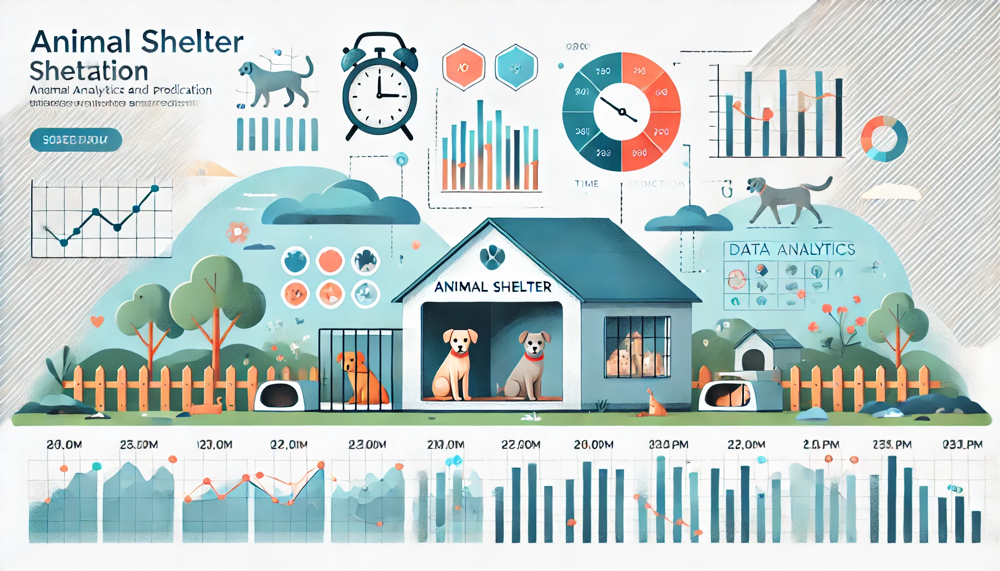

# Shelter Animal Adoption Prediction

## Table of Contents
1. [Introduction](#introduction)
2. [Dataset](#dataset)
3. [Prerequisites](#prerequisites)
4. [Steps to Install](#steps-to-install)
5. [Steps to Create the Docker Container and Run the Service](#steps-to-create-the-docker-container-and-run-the-service)
6. [Usage](#usage)

## Introduction
This project aims to predict the time (in days) that an animal will spend in the shelter before being adopted. The shelter has limited capacity, and it is crucial to determine whether an animal will be adopted within a short timeframe (approximately two weeks) or take longer. This helps prioritize efforts for animals facing adoption challenges.

## Dataset
The dataset used comes from real records of the **Austin Animal Shelter** in Texas. You can explore the source data on their official website:  
[City of Austin Animal Shelter](https://www.austintexas.gov/austin-animal-center).

The dataset consists of two main parts:
- **Intakes**: Records of animal intakes at the shelter. [Details](https://data.austintexas.gov/Health-and-Community-Services/Austin-Animal-Center-Intakes/wter-evkm/about_data)
- **Outcomes**: Records of the outcomes for those same animals. [Details](https://data.austintexas.gov/Health-and-Community-Services/Austin-Animal-Center-Outcomes/9t4d-g238/about_data)

### Dataset Summary
- Records: 2014–11/10/2024 (date downloaded).
- The dataset was created by merging `intakes` and `outcomes` with adjustments:
  1. For animals with multiple intakes, the outcome closest to the intake was used.
  2. Overlapping intake periods for the same animal were removed.
  3. Only `Adoption` outcomes were kept.

Detailed steps can be found in the `time_shelter_dataset` file.

### Dataset Columns
1. **`animal_id`**: Unique ID for each animal.
2. **`name`**: Name of the animal (NaN if unnamed).
3. **`datetime_intake`**: Intake date and time.
4. **`found_location`**: Location where the animal was found.
5. **`intake_type`**: Reason or method of intake (e.g., "stray").
6. **`intake_condition`**: Condition of the animal at intake.
7. **`animal_type`**: Species of the animal (e.g., "cat"). For this model dogs and cats were used. 
8. **`sex_upon_intake`**: Sex and sterilization status upon intake.
9. **`age_upon_intake`**: Approximate age at intake.
10. **