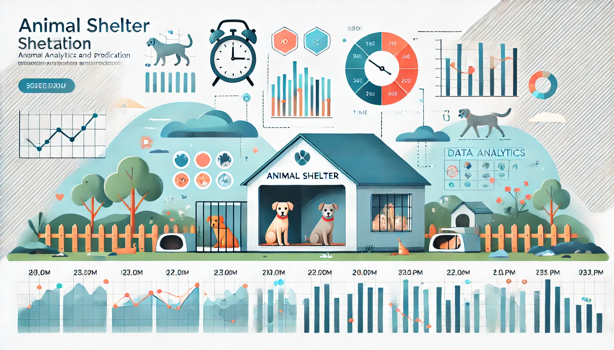

# Animal Adoption Days Prediction

## Table of Contents
1. [Introduction](#introduction)
2. [Dataset](#dataset)
3. [Prerequisites](#prerequisites)
4. [Steps to Install](#steps-to-install)
5. [Steps to Create the Docker Container and Run the Service](#steps-to-create-the-docker-container-and-run-the-service)
6. [Using the model in AWS](###-Using-model-in-AWS)

-------
## Introduction
There is a a shelter located in Texas that has accepted more than 167K dogs and cats during the lasts years. The main problem they have is that they need to speed up the addoption of the animals so as they have empty places to receive more animals, as during the lasts years they had to restrict the number of intakes due to limitations. 
So as to improve their actions and be more efficient, they want something sutomatic that tells them the expected time the animal will stay in the shelter, if the animal is staying 1'2 weeks thye might not need to take special care about promoting the animal but if they know that the specific animal will take longer ddue to its conditions they can focus effeorts promoting it. 
As we have seem the time the animal needs to be addopted can vary a lot between breeds, their health conditions, age, so is very complicated for them to estimate the time. 
In this graph below we can see the boxplot of the time the animals stay in the shelter 

In Texas, there is a shelter that has cared for over 167,000 dogs and cats in recent years. However, the shelter faces a significant challenge: space limitations. Due to these constraints, they have had to restrict the number of animals they can intake, leaving many in need of care without help.

To address this issue, the shelter seeks to optimize its operations by predicting how long each animal is likely to stay before being adopted. This insight will allow the staff to prioritize efforts strategically:

- If an animal is expected to stay for a short period (1–2 weeks), promotion efforts might not be necessary.
- On the other hand, animals predicted to stay longer—due to their breed, health condition, age, or other factors—can be given additional attention, such as increased marketing or special adoption campaigns.
The time an animal spends in the shelter varies widely and is influenced by several complex factors. Estimating this 