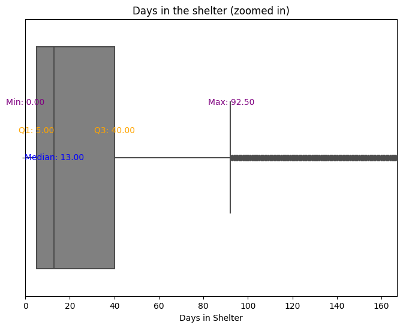

# Animal Adoption Days Prediction


## Table of Contents
1. [Introduction](#introduction)
2. [Dataset](#dataset)
3. [Prerequisites](#prerequisites)
4. [Steps to Install](#steps-to-install)
5. [Steps to Create the Docker Container and Run the Service](#steps-to-create-the-docker-container-and-run-the-service)
6. [Using the model in AWS](###-Using-model-in-AWS)

-------
## Introduction

In Texas, there is a shelter that has cared for over 167,000 dogs and cats in recent years. However, the shelter faces a significant challenge: space limitations. Due to these constraints, they have had to restrict the number of animals they can intake, leaving many in need of care without help.

To address this issue, the shelter seeks to optimize its operations by predicting how long each animal is likely to stay before being adopted. This insight will allow the staff to prioritize efforts strategically:

- If an animal is expected to stay for a short period (1–2 weeks), promotion efforts might not be necessary.
- On the other hand, animals predicted to stay longer—due to their breed, health condition, age, or other factors—can be given additional attention, such as increased marketing or special adoption campaigns.
The time an animal spends in the shelter varies widely and is influenced by several complex factors. Estimating this time manually has proven to be a challenge for the staff. Below, we explore the variability in the duration of stays through a boxplot visualization:


What Does the Graph Tell Us?
- Median Stay: The median stay for animals is 13 days, meaning 50% of animals are adopted within this time.
- Range of Stay: While many animals are adopted quickly (minimum stay of 0 days), some require significantly more time, with a maximum typical stay around 92.5 days (as per the interquartile range).
- Outliers: Beyond 92.5 days, there are outliers indicating some animals stay for extremely long durations—potentially months—before being adopted.
- Interquartile Range (IQR): The middle 50% of animals (between Q1 = 5 days and Q3 = 40 days) highlight the variation in adoption speeds for the majority of cases.

This variability underscores the importance of using data-driven predictions to better manage shelter operations. The model aims to predict the adoption timeline for each animal based on key factors, enabling the shelter to allocate resources effectively and reduce the average duration of stays.

### Summary 
This project aims to predict the time (in days) that an animal will spend in the shelter before being adopted. The shelter has limited capacity, and predicting adoption timelines is critical:

Short-stay animals: Require minimal promotion effort.
Long-stay animals: Need targeted campaigns to improve adoption rates.
Through this predictive tool, the shelter can maximize its efficiency, ensure more animals find homes, and ultimately save more lives.

-------
## Dataset
The dataset used comes from real records of the **Austin Animal Shelter** in Texas. You can explore the source data on their official website:  
[City of Austin Animal Shelter](https://www.austintexas.gov/austin-animal-center).

The dataset consists of two main parts:
- **Intakes**: Records of animal intakes at the shelter. [Details](https://data.austintexas.gov/Health-and-Community-Services/Austin-Animal-Center-Intakes/wter-evkm/about_data)
- **Outcomes**: Records of the outcomes for those same animals. [Details](https://data.austintexas.gov/Health-and-Community-Services/Austin-Animal-Center-Outcomes/9t4d-g238/about_data)
 
### Dataset Summary
- Records: 2014–11/10/2024 (date downloaded).
- The dataset was created by merging `intakes` and `outcomes` with adjustments:
  1. For animals with multiple intakes, the outcome closest to the intake was used.
  2. Overlapping intake periods for the same animal were removed.
  3. Only `Adoption` outcomes were kept.
  4. Only animals with aninal_type in Dog or Cat are considered.

Detailed steps can be found in the `time_shelter_dataset` file.
 
### Dataset Columns
1. **`animal_id`**: Unique ID for each animal.
2. **`name`**: Name of the animal (NaN if unnamed).
3. **`datetime_intake`**: Intake date and time.
4. **`found_location`**: Location where the animal was found.
5. **`intake_type`**: Reason or method of intake (e.g., "stray").
6. **`intake_condition`**: Condition of the animal at intake.
7. **`animal_type`**: Species of the animal (e.g., "cat"). For this model dogs and cats were used. 
8. **`sex_upon_intake`**: Sex and sterilization status upon intake.
9. **`age_upon_intake`**: Approximate age at intake.
10. **`breed`**: Animal breed or mix.
11. **`color`**: Coat color(s).
12. **`datetime_outcome`**: Adoption date and time.
13. **`outcome_type`**: Final outcome status (always "Adoption").

-------

## Prerequisites
- **`git`**: To clone the repository.
- **`Anaconda` (`conda`)**: For virtual environment management.
- **`Docker`**: For deployment and testing.
- **`AWS CLI`**: For cloud-based services (optional).

-------
## Steps to Install
1. Clone the repository:
   ```bash
   git clone https://github.com/irenebustos/shelter_addoption_days_ML_prediction.git

2. create conda environment with python 3.11
 ```bash
   conda create -n ml-shelter python=3.11
   ```
3. Activate the the virtual environment:
   ```bash
   conda activate ml-shelter
   ```
4. install required python packages (go to the path where the repository is located  ¨cd .../shelter_addoption_days_ML_prediction¨) 
   ```bash
    pip install -r requirements.txt
   ```
4. Install the pipenv 
for that pipenv is needed:

   ```bash
    pip install pipenv
   ```
then run 

   ```bash
   pipenv install 
   ```

activate the environment:
   ```bash
   pipenv shell
   ```
-------
## Steps to create the docker container and run the service
1. create docker container using puthon 3.11-slim:
   ```bash
    docker run -it --rm --entrypoint=bash python:3.11-slim
   ```
2. exit from the docker container using 

   ```bash
    exit
   ```
3. Create docker image for this model:

   ```bash
    docker build -t zoomcamp_shelter .
   ```
4. run the docker container: 
   ```bash
    docker run -it --rm -p 9696:9696 zoomcamp_shelter

5. open another tab in the terminal and run the example predict_test_ where there is an example of an animal entering the shelter (values can be modifiyed):

   ```bash
    python predict_test_.py
   ```
To stop the service, press `Ctrl+C` in the terminal.

-------
## Using model in AWS
the jupyter notebook called ¨predict_test_AWS_env.ipynb¨is ready with the ULR of the service and can be used.
See here how to use it:

[](https://youtu.be/9WMYAk-v2j4)
